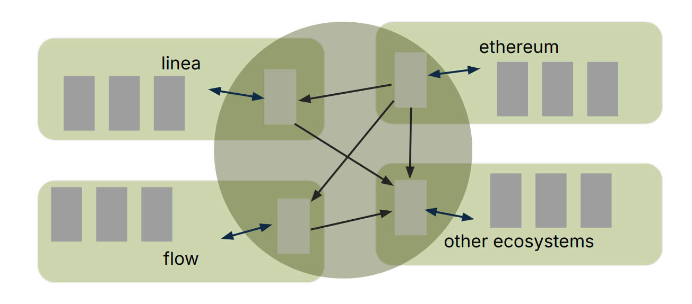

# Design Goals

## Privacy

zkERC20's privacy guarantees can be thought of in terms of a circle as shown below, where an ERC-20 may enter or exit at any time, on any supported chain:

After ERC-20 token enters the "privacy circle," zkERC20 makes the following guarantees:

- **Sender Privacy**: A zkERC20 transfer's sender is not revealed.
    - Note that transfer sender's address may be leaked if the transaction sender is the same as the transfer sender. We recommend submitting the transaction from a unique address that is not associated with the transfer sender.
- **Receiver Privacy**: A zkERC20 transfer's receiver is not revealed.
    - Upon withdrawing from the privacy circle, the receiver's address is revealed.
- **Amount Privacy**: A zkERC20 transfer's amount is not revealed.
    - Analysis of deposits and withdrawals may reveal a connection between a depositor and withdrawer (e.g., if the amounts are the same). To maintain privacy, we recommend withdrawing amounts that are not easily correlated with deposits. Consider spreading withdrawals across multiple transactions.
- **Asset Privacy**: A zkERC20 transfer's asset is not revealed.
    - While it is possible to know that some asset is being bridged or transferred, to an outside observer, it is not possible to determine specifically which asset is being transferred or bridged. Of course, the observer will know that the asset is within the set of assets that have been deposited (but not fully withdrawn).

These guarantees must be maintained whether transferring in the same chain, or across chains.

## Trustlessness

The protocol should be mostly trustless, with the only exception being bridging; fundamentally, trust must be placed in entities to confirm the validity of bridge messages.

To that end, no contracts in any code execution flow (except at the ERC-20 level and after) will be upgradeable.

